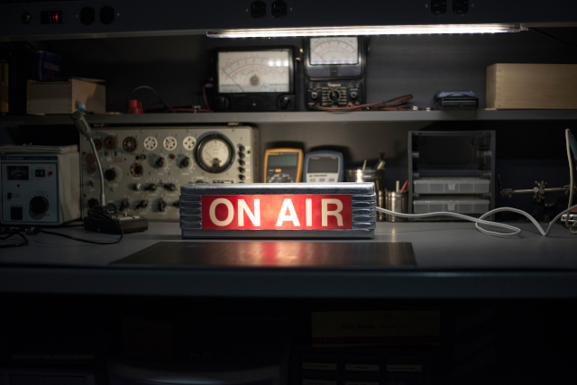
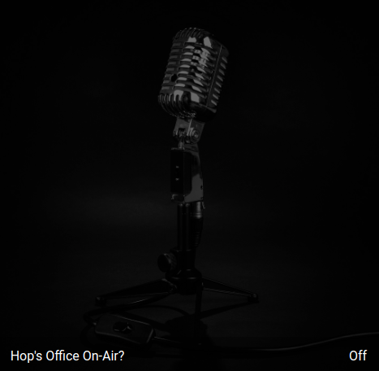
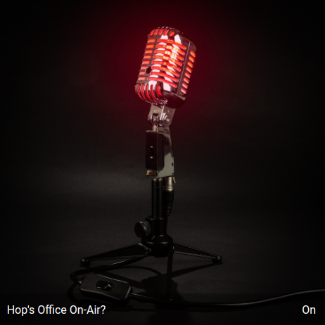

# live-status

A service to detect video and microphone use on your host and posts status changes to an MQTT topic.

## Why live-status?

Many of us regularly use video and voice to collaborate with colleagues in online meetings,
record videos, podcasts and the like. We do this in our workplace office or in dedicated areas in our house. 
Unfortunately it is almost impossible for those we live or work with to known when you are
live and On-Air, particularly behind closed doors. In turn, those with whom you co-inhabit don't know when they need 
to be extra quiet or avoid walking in to your live session with a culinary or even a salacious treat.

This small service aims to alleviate the confusion and detect and post your current live status
as an MQTT topic, such that you can decide how to physically represent your current On Air status suitable to your
specific work space.

As a concrete example, you may have a dedicated office in your house from which you work and this has a closed door.
You want to indicate to the outside world, whenever you are On Air or not. This is not a new problem or idea,
after all, studios have been tackling this for decades and a whole industry and range of equipment has resulted.

This utility solves only a part of the problem, that is detect whenever your microphone and/or video is live.
It posts status changes on an MQTT topic to whichever MQTT broker you configure. From that point, you decide how
to do the physical part. As an example, the author does this:

- Subscribe to the MQTT topic using [Node Red](https://cookbook.nodered.org/mqtt/connect-to-broker)
- The Node Red flow calls a service on [Home Assistant](https://www.home-assistant.io/integrations/input_boolean)
  so as to toggle the state of a defined boolean there.
- Define a [Picture Entity Card](https://www.home-assistant.io/lovelace/picture-entity/) in Home Assistant GUI to
  show the current status.
- Display the Home Assistant dashboard card on a WiFi connected tablet mounted on the wall outside the office.

Obviously there are simpler ways, like a simple USB or serially driven On Air LED light and using a Raspberry Pi Zero.
The possibilities are endless, and left as an exercise for the reader.

The example of the author's picture card visible through numerous Home Assistant dashboard in the house.

## Installation and running

This is tested and working on Linux Ubuntu 20.04.3 LTS and expects python3 and paho-mqtt module installed.

- `pip install -r requirements.txt`
- In live-status.py change where your MQTT broker lives `broker = "localhost"` to whatever IP address if not on your host.

### Running: Simple

Run live-status.sh from this repo via `./live-status.sh`

### Running: Automatic/Advanced
 
Just setup live-status.sh to run on startup, e.g. on Ubuntu as a [startup app](https://askubuntu.com/questions/48321/how-do-i-start-applications-automatically-on-login)
Alternately, you can set it up to run as a service (an example `live-status.service` file included).

> NOTE: When run as a service, due to `pactl` needing to run as user, then detecting microphones does not work.

